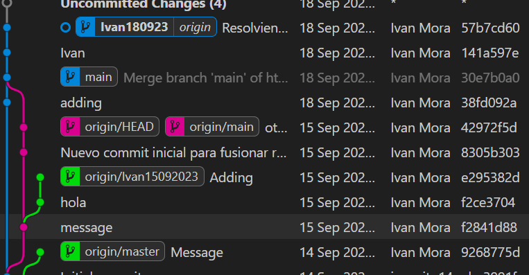
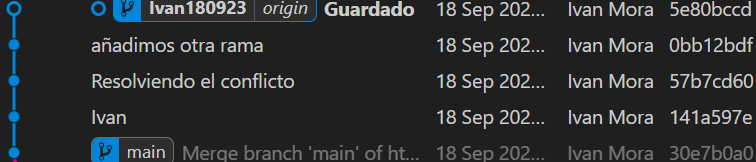
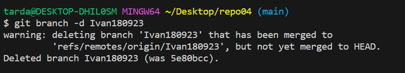
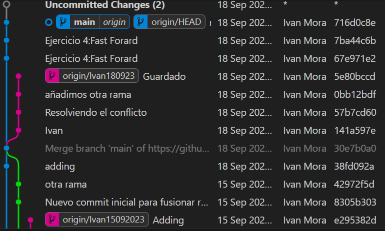

REPOSITORIO 04

📌4.1 – Crea un directorio llamado repo04, esta vez tu decides como lo haces. Es decir, tendrás que
seleccionar uno de los dos caminos que hemos visto en los dos ejercicios anteriores.Pero si que
queremos que exista el repositorio el local y en remoto.

- Primero lo que he echo a sido crear el `repo4`
  de manera local con `mkdir repo04` y accedemos a ella con `cd repo04` despues de a ver echo `cd deskop` etc... y lo desde git hub añadimos un repositorio llamado `repo04`.

📌4.2 – Añade un fichero readme.md vacío al repositorio local, ejecuta los comandos pertinentes para realizar un commit y finalmente, sube los cambios al repositorio remoto que tendrá el mismo nombre repo04.

📌4.3 – Crea una rama con tu nombre y la fecha actual (por ejemplo en mi caso la rama se llamará
david02032022)

📌4.4 – Desde tu rama (david02032022) edita el fichero readme.md de tal forma que quede de la siguiente
manera:

📌4.5 – Haz 3 commits desde nuestra rama (david02032022)

📌4.6 – En el siguiente orden realiza lo siguiente:
📌4.6.1 – Fusiona tu rama con master
Usaremos ``git merge master`` para poderlo fusionar 

📌4.6.2 – Haz un push hacía la nube
- Subiremos los cambios 

📌4.7 – Elimina solamente la rama en local david02032022 ya que si eliminásemos la remota no veríamos la rama en remoto.
- Usaremos el comando ``git branch -d Ivan180923``

4.8 - Visualiza el resultado tanto mediante el comando git log --all --oneline -decorate –graph, comodesde el pluging de VSC

